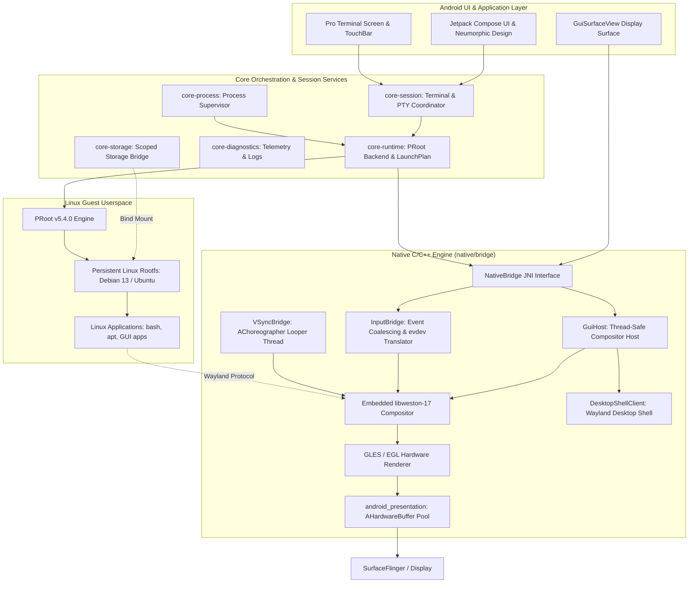

# LinuxDroid

<div align="center">

```
  _      _                      _____                 _       _ 
 | |    (_)                    |  __ \               (_)     | |
 | |     _ _ __  _   ___  __   | |  | |_ __ ___  _ __ _  ___ | |
 | |    | | '_ \| | | \ \/ /   | |  | | '__/ _ \| '__| |/ _ \| |
 | |____| | | | | |_| |>  <    | |__| | | | (_) | |  | | (_) |_|
 |______|_|_| |_|\__,_/_/\_\   |_____/|_|  \___/|_|  |_|\___/(_)
```

### *True Persistent, Rootless Linux Userspace on Android*

[-3DDC84?logo=android&logoColor=white)](https://developer.android.com)
[-brightgreen?logo=android)](https://developer.android.com)
[](https://kotlinlang.org)
[](https://gradle.org)
[](LICENSE)
[-orange)](#system-specifications)
[](docs/display/wayland.md)
[](https://github.com/InfidelRahul/LinuxDroid)

[Features](#-key-features) • [Architecture](#-architecture) • [App Usage & Workflows](#-app-usage--workflows) • [System Specifications](#-system-specifications) • [Documentation](#-documentation-index) • [Building & Installation](#-building--installation)

---

</div>

## 📖 Overview

**LinuxDroid** is a high-performance native Android application engineered to run a complete, persistent, rootless Linux distribution and graphical desktop environment directly on Android hardware.

Unlike traditional solutions that depend on root access, QEMU/KVM virtual machine emulation, custom kernels, or fragile chroot hacks, LinuxDroid utilizes a hardened userspace syscall interception architecture based on **PRoot** (`ptrace(2)` and `seccomp`). Linux binaries execute directly on the bare-metal CPU with zero virtualization overhead.

For graphical workloads, LinuxDroid embeds the official **libweston-17 Wayland compositor** directly into its native C++ runtime. It drives hardware-accelerated OpenGL ES 3.0 rendering, presents frames through Android's `AHardwareBuffer` and `ASurfaceControl` zero-copy pipeline, synchronizes with Android physical display VSync via `AChoreographer`, and features an integrated Wayland Desktop Shell with a responsive taskbar, window manager, and application launcher.

---

## ⚡ Key Features

### 🛡️ 100% Rootless & Containerless
* **Zero Root Required**: Operates completely inside the standard Android application sandbox without root permissions.
* **Bare-Metal CPU Execution**: Linux binaries run natively on the device's CPU cores without hypervisor or instruction translation overhead.
* **Production Kernel Compatibility**: Compatible with standard production Android kernels (Linux 4.14 through 6.6+ on Android 16/17).
* **Persistent Rootfs**: Your Linux environment, configurations, packages, and files are permanently preserved across app updates, device reboots, and session terminations.

### 🖥️ Native Embedded Wayland Desktop
* **Embedded libweston-17 Compositor**: Real, production-grade Wayland compositor embedded directly inside the Android process.
* **Hardware-Accelerated GLES Renderer**: Composites client surfaces via OpenGL ES 3.0 (`gl-renderer`) with automatic, graceful fallback to NEON-accelerated Pixman software rendering.
* **Zero-Copy Presentation Pipeline**: High-performance triple-buffered `AHardwareBuffer` pool combined with `ASurfaceControl` transactions and hardware sync fences.
* **Android Display VSync Synchronization**: Repaint scheduling is locked to physical display timing via `AChoreographer` on a dedicated ALooper thread, dynamically adapting to 60 Hz, 90 Hz, and 120 Hz displays with zero-wake idle gating.
* **Integrated Desktop Shell**: Built-in desktop environment featuring a customizable wallpaper background, responsive 48px taskbar panel, dynamic window list with window switcher, digital clock, and guest application launcher.
* **XDG Window Management**: Complete support for `xdg_shell` toplevel windows, popups, window activation, focus tracking, and graceful closure.

### ⌨️ Unified Input Subsystem
* **Pointer & Mouse Integration**: Full mouse support including button bitmasks (`BTN_LEFT`, `BTN_RIGHT`, `BTN_MIDDLE`, `BTN_SIDE`, `BTN_EXTRA`), coordinate bounds clamping, and smooth wheel scrolling.
* **Multi-Touch Support**: Native touchscreen translation with discrete `wl_touch` slot tracking and atomic frame dispatch.
* **Keyboard Translation**: Converts Android key events to standard Linux `evdev` keysyms with full modifier tracking (`Shift`, `Ctrl`, `Alt`, `Meta/Super`).
* **High-Frequency Motion Coalescing**: Consecutive pointer and touch move events are coalesced in a bounded FIFO queue, minimizing input latency and preventing queue saturation during rapid gestures.

### 💻 Pro macOS-Inspired Neumorphic Terminal
* **Real POSIX PTY Subsystem**: Native pseudo-terminal (`openpty`, `termios`, `ioctl(TIOCSWINSZ)`) for interactive shell sessions.
* **macOS Neumorphic Theme**: Soft elevation shaders supporting both Light and Dark mode with contrast normalization.
* **TouchBar Extra Keys**: Tactile modifier bar with LED status indicators for `CTRL`, `ALT`, `ESC`, `TAB`, arrow keys, and pipe symbols.
* **Spotlight-Style Search**: In-terminal keyword search with match counter (`1/5`) and live jump navigation.
* **ANSI 256-Color Palette**: Theme-aware color mapper preventing unreadable output.
* **Apple Typography**: Bundled official San Francisco (SF Pro, SF Mono) and JetBrains Mono fonts.

### 📂 Storage & Host Integration
* **Scoped Storage Bridge**: Seamless bi-directional file sharing bind-mounting Android `/sdcard/LinuxDroid` to `/home/user/Android`.
* **Hardware Diagnostics**: Real-time SoC telemetry (CPU cores, RAM usage, storage space, kernel release, SELinux status).
* **Failure Log Exporter**: Causal chain tracking and one-click JSON/plain-text diagnostic export.

---

## 📊 System Specifications

| Specification | Details |
| :--- | :--- |
| **Minimum Android Version** | Android 9.0 (API level 28) |
| **Target Android Version** | Android 16 / 17 (API level 36) |
| **Supported Architecture** | `arm64-v8a` (ARM64 / AArch64) |
| **Default Distribution** | Debian 13 (Trixie) / Ubuntu 24.04 LTS (Noble Numbat) |
| **Syscall Interception Engine** | PRoot v5.4.0 (Hardened with Bionic ptrace & ARM64 TBI pointer normalization) |
| **Display Compositor** | Embedded libweston-17 with Wayland `xdg-shell` protocol |
| **Compositor Renderer** | OpenGL ES 3.0 / EGL (`gl-renderer`) with Pixman NEON software fallback |
| **Presentation Pipeline** | Triple-Buffered `AHardwareBuffer` + `ASurfaceControl` + Sync Fences |
| **Display Clock / Timing** | Android `AChoreographer` VSync (60 Hz / 90 Hz / 120 Hz dynamic refresh) |
| **Input Subsystem** | Direct `MotionEvent` / `KeyEvent` → Linux `evdev` translation with coalescing |
| **Build Toolchain** | OpenJDK 21 • Gradle 9.7.1 • AGP 9.3.2 • Kotlin 2.3.20 • NDK 30 (Clang 23.1.0) |

---

### 🧩 Core Stack Git Submodules (`vendor/`)

LinuxDroid isolates and consumes its core native components directly from dedicated repositories under the `LinuxDroidapp` organization, pinned to exact commits:

| Submodule | Repository | Pinned Revision | Description |
| :--- | :--- | :--- | :--- |
| `vendor/proot` | [LinuxDroidapp/proot](https://github.com/LinuxDroidapp/proot) | `caadcae0e7697ec29f02e231a3a88866561aacd0` | Hardened PRoot execution engine with Bionic ptrace workarounds & TBI handling |
| `vendor/LDDM` | [LinuxDroidapp/LDDM](https://github.com/LinuxDroidapp/LDDM) | `aa6c3d38f874244bcd60162889a914637e4ddf46` | LinuxDroid Display Manager & session coordinator |
| `vendor/LDDE` | [LinuxDroidapp/LDDE](https://github.com/LinuxDroidapp/LDDE) | `9ee575e963d6d1ff4086fc16fb119daf6ead6db2` | LinuxDroid Desktop Environment graphical workspace |

### 📦 Linux Rootfs Package Dependencies

Wayland, Weston, Wayland-protocols, and Pixman are supplied by the **Linux distribution package manager** inside the rootfs. They are not Android project Git submodules.

| Component | Package | Source |
| :--- | :--- | :--- |
| Wayland | `libwayland-dev` | Linux distribution (Debian/Ubuntu APT) |
| Weston | `weston` | Linux distribution (Debian/Ubuntu APT) |
| Wayland Protocols | `wayland-protocols` | Linux distribution (Debian/Ubuntu APT) |
| Pixman | `libpixman-1-dev` | Linux distribution (Debian/Ubuntu APT) |

The rootfs deployment pipeline (`linux/bootstrap`) installs these packages automatically during environment provisioning.

For complete submodule management guidelines, see [docs/vendor/submodules.md](docs/vendor/submodules.md).


## 🏛️ Architecture

LinuxDroid is structured into 17 clean, decoupled Gradle modules following Google's modern Android architecture guidelines:



### Display & Rendering Pipeline

```text
Wayland Client Application
        │ (wl_surface / xdg_toplevel)
        ▼
Weston Scene Graph
        │
        ▼ (Scheduled by Android VSync AChoreographer)
libweston Repaint Cycle
        │
        ▼
GLES / EGL Renderer (gl-renderer)
        │
        ▼ (Renders into offscreen buffer)
AHardwareBuffer (Triple-Buffered Pool)
        │
        ▼ (Acquire / release sync fences)
ASurfaceControl Transaction
        │
        ▼
Android SurfaceFlinger
        │
        ▼
Physical Screen (60 / 90 / 120 Hz)
```

---

## 📦 Modular Architecture

```
LinuxDroid/
├── app/                      # Application shell, Navigation, Compose UI, Hilt DI root
│   └── src/main/res/font/    # Bundled Apple SF Pro & SF Mono typography
├── core/
│   ├── core-model/           # Domain models (Environment, Session, Process, Telemetry)
│   ├── core-logging/         # High-performance structured logging subsystem
│   ├── core-database/        # Room Database for Android environment metadata
│   ├── core-runtime/         # PRoot backend abstraction and launch plan validator
│   ├── core-process/         # Process execution supervisor and lifecycle tracking
│   ├── core-session/         # Terminal PTY session coordinator
│   ├── core-filesystem/      # Rootfs storage validation and atomic path manager
│   ├── core-storage/         # Scoped Storage / SAF shared folder bridge
│   ├── core-display/         # Wayland compositor protocol and surface renderer
│   ├── core-gpu/             # GPU acceleration interfaces (VirGL / Mesa Zink)
│   ├── core-input/           # Virtual keyboard, mouse, and touch input handler
│   ├── core-audio/           # Audio output bridge (PulseAudio / AAudio)
│   ├── core-network/         # Network state monitor and port forwarder
│   ├── core-package/         # Linux package manager abstraction
│   └── core-diagnostics/     # Deduplicated error aggregation and log export
├── native/
│   └── bridge/               # JNI bridge (POSIX openpty, process forks, signal handling)
├── linux/
│   └── bootstrap/            # Rootfs streaming download, verify, and extraction
└── docs/                     # Comprehensive architectural and subsystem documentation
```

---

## 📚 Documentation Index

Explore our comprehensive technical documentation:

| Document | Description |
| :--- | :--- |
| 📘 [Architecture Overview](docs/architecture/overview.md) | High-level system architecture and component interactions |
| 📐 [Architecture Blueprint](docs/architecture/blueprint.md) | Detailed subsystem specifications and data flow models |
| 🖥️ [Wayland Display & Compositor](docs/display/wayland.md) | Embedded libweston compositor, GLES renderer, VSync, and Desktop Shell |
| 🎮 [GPU Acceleration & Rendering](docs/display/gpu.md) | GLES/EGL renderer, shaders, Pixman fallback, and Vulkan Zink |
| ⌨️ [Input Subsystem](docs/input/input.md) | Android input capture, evdev translation, and motion event coalescing |
| ⚙️ [Rootless PRoot Runtime](docs/runtime/rootless-runtime.md) | Syscall interception, ptrace mechanics, and ARM64 TBI pointer fix |
| 📱 [Android Integration](docs/architecture/android.md) | Lifecycle management, Foreground Services, and Jetpack Compose |
| 🔌 [Native JNI Bridge](docs/architecture/native.md) | NativeBridge C++ architecture, PTY subsystem, and signal handling |
| 📁 [Storage & Shared Folders](docs/storage/storage.md) | Scoped storage, SAF permissions, and bind-mount rules |
| 🔒 [Security Model](docs/security/security.md) | Sandboxing, SELinux compatibility, and privilege boundaries |
| 🧪 [Testing Guide](docs/testing/testing.md) | Unit test suite, integration tests, and mock strategies |
| 🛠️ [Build & Compilation Guide](docs/development/build.md) | Toolchain setup, NDK build flags, and release signing |

---

## 🚀 Building & Installation

### Prerequisites
- **JDK**: OpenJDK 21 (Temurin or SDKMAN).
- **Android SDK**: Android API 36 / 37 (`platforms;android-36`, `build-tools;36.0.0`).
- **Android NDK**: NDK version `30.0.16138531` (NDK 30, Clang 23.1.0).
- **CMake**: Version `4.4.3`.

### Quick Build Commands

```bash
# 1. Clone the repository
git clone https://github.com/InfidelRahul/LinuxDroid.git
cd LinuxDroid

# 2. Configure Environment Variables
export ANDROID_HOME=/path/to/android-sdk
export ANDROID_NDK_ROOT=$ANDROID_HOME/ndk/30.0.16138531

# 3. Run all unit tests across modules
./gradlew testDebugUnitTest --no-daemon

# 4. Assemble Debug APK
./gradlew :app:assembleDebug --no-daemon

# 5. Assemble Release Signed APK
./gradlew :app:assembleRelease --no-daemon
```

### Build Artifacts
- **Debug APK**: `app/build/outputs/apk/debug/app-debug.apk`
- **Release APK**: `app/build/outputs/apk/release/app-release.apk`

---

## 📱 App Usage & Workflows

### 1. First Launch & Rootfs Bootstrap
1. When LinuxDroid is launched for the first time, it checks for an existing rootfs installation.
2. If no environment exists, the setup wizard guides you through selecting a distribution (Debian 13 Trixie default).
3. The rootfs archive is verified against SHA-256 integrity checksums and extracted into the app's sandboxed private storage (`/data/data/com.linuxdroid.app/files/environments/<id>/rootfs`).
4. System bind mounts (`/proc`, `/sys`, `/dev`, `/dev/pts`, `/dev/shm`) and the shared storage bridge (`/sdcard/LinuxDroid` → `/home/user/Android`) are automatically initialized.

### 2. Pro Terminal Interface
* **Interactive Shell**: Starts a login shell (`/bin/bash -l`) with full POSIX terminal capabilities.
* **TouchBar Extra Keys**: Use the dedicated on-screen modifier row for quick access to `CTRL`, `ALT`, `ESC`, `TAB`, arrow keys, and pipe `|`.
* **Spotlight Search**: Tap the search icon to find text in your terminal history with live match highlighting.
* **Package Management**: Install your favorite command-line tools:
  ```bash
  apt update && apt install -y git curl wget vim build-essential python3
  ```

### 3. Wayland Desktop Environment
* **Starting the Desktop**: Tap **Launch Desktop** from the main dashboard or run the desktop session.
* **Desktop Shell**:
  - **Wallpaper**: High-resolution branded desktop background.
  - **Taskbar Panel**: Bottom-anchored 48px panel featuring the application launcher, dynamic window list, and digital clock.
  - **Window Switching**: Tap any window pill in the taskbar to raise and focus the application.
  - **Window Controls**: Click the window titlebar to drag, move, or close windows.
* **Running Graphical Applications**:
  Launch GUI applications directly from the application launcher menu or via the terminal:
  ```bash
  # Install and run lightweight Linux desktop apps
  apt update
  apt install -y mousepad galculator pcmanfm firefox-esr
  mousepad &
  ```

### 4. File Sharing with Android
* Files placed in Android's shared storage at `/sdcard/LinuxDroid` appear instantly inside your Linux session at `/home/user/Android`.
* Edit code on Linux and access the generated files in Android apps, or download assets on Android and process them with Linux command-line tools.

---

## 👨‍💻 Developer & Maintainer

<div align="center">

**Crafted with passion by [InfidelRahul](https://github.com/InfidelRahul)**

[](https://github.com/InfidelRahul)
[](https://github.com/InfidelRahul/LinuxDroid/issues)

</div>

---

## 📄 License

```text
Copyright 2026 Rahul Kumar (InfidelRahul)

Licensed under the Apache License, Version 2.0 (the "License");
you may not use this file except in compliance with the License.
You may obtain a copy of the License at

    http://www.apache.org/licenses/LICENSE-2.0

Unless required by applicable law or agreed to in writing, software
distributed under the License is distributed on an "AS IS" BASIS,
WITHOUT WARRANTIES OR CONDITIONS OF ANY KIND, either express or implied.
See the License for the specific language governing permissions and
limitations under the License.
```
